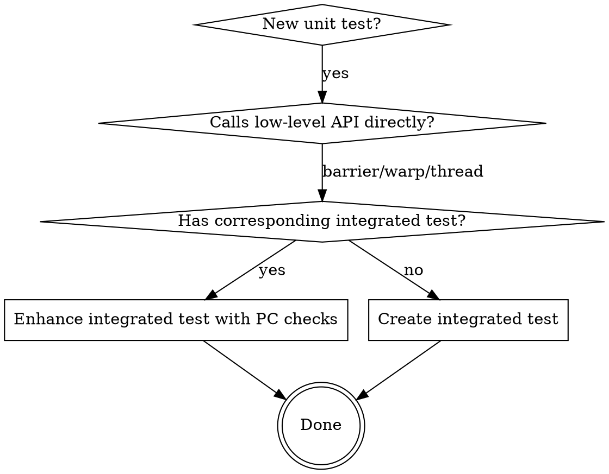

# Test Coverage Enforcer

## Overview

Ensure unit tests that directly test low-level APIs (Wbar, ThreadContext, WarpContext) have corresponding integration tests that validate the same scenarios through the full instruction execution pipeline (`execute_warp_instruction`).

## When to Use

- Adding new unit test that calls `wbar.arrive()`, `warp.get_wbar()`, `thread.set_pc()`, or similar low-level APIs directly
- Creating test for barrier, warp divergence, PC management, or thread state scenarios
- Modifying existing unit tests in `tests/test_*.cpp`

## Core Pattern



## Process

### Step 1: Identify Unit Test Type

Unit tests that need integrated counterparts:
- `test_barrier_*.cpp` - barrier synchronization
- `test_warp_*.cpp` - warp divergence/execution
- `test_thread_*.cpp` - thread state/PC management
- Any test using `warp->get_wbar()` directly
- Any test calling `thread->set_pc()` or `thread->get_pc()`
- Any test using `arrive()`, `is_complete()`, `init()` on Wbar

### Step 2: Find Corresponding Integrated Test

Look for `*_integrated.cpp` tests or tests using `execute_warp_instruction`:

```bash
# Find tests using execute_warp_instruction
grep -l "execute_warp_instruction" tests/*.cpp

# Find unit test for same scenario
grep -l "wbar.arrive\|get_wbar\|init(" tests/test_barrier*.cpp
```

### Step 3: Mapping Reference

| Unit Test Pattern | Integrated Test Pattern |
|-------------------|------------------------|
| `warp->get_wbar(0).arrive(i)` | `warp->execute_warp_instruction(barrier_stmt, target_pc)` |
| `warp->get_wbar(0).is_complete()` | Thread PC verification after barrier |
| `warp->get_wbar(0).count_arrived()` | `warp->get_wbar(0).count_arrived()` |
| Direct thread PC manipulation | `execute_warp_instruction` drives PC changes |

### Step 4: Enhance or Create Integrated Test

**If integrated test exists:**
Add PC verification after barrier execution:

```cpp
// Unit test (direct API)
warp->get_wbar(0).init(0xFFFFFFFF, 5);
warp->get_wbar(0).arrive(i);
CHECK(warp->get_wbar(0).is_complete() == true);

// Integrated test (should add):
warp->execute_warp_instruction(barrier_stmt, 1);
CHECK(warp->get_wbar(0).is_complete() == true);
CHECK(warp->get_wbar(0).count_arrived() == 32);
// NEW: Thread PC verification
for (int i = 0; i < 32; i++) {
    CHECK(warp->get_thread(i)->get_pc() == 2);  // reconvergence PC
}
```

**If integrated test doesn't exist:**
Create with same expectations:

```cpp
TEST_CASE("integrated_<scenario_name>", "[barrier][integrated]") {
    init_instruction_factory_once();
    
    // Build statement sequence matching unit test scenario
    statements.push_back(make_mov_stmt());           // PC=0
    statements.push_back(make_barrier_stmt(...));    // PC=1
    statements.push_back(make_mov_stmt());           // PC=2
    
    WarpContext* warp = create_warp_with_threads(sm, create_block(statements));
    
    // Execute through pipeline (like real execution)
    warp->execute_warp_instruction(statements[0], 0);
    warp->execute_warp_instruction(statements[1], 1);
    
    // Verify Wbar state (same as unit test)
    CHECK(warp->get_wbar(0).is_complete() == true);
    CHECK(warp->get_wbar(0).count_arrived() == 32);
    
    // NEW: Verify thread PC (unit test verifies Wbar, integrated verifies PC)
    for (int i = 0; i < 32; i++) {
        CHECK(warp->get_thread(i)->get_pc() == reconvergence_pc);
    }
}
```

### Step 5: Verify Expectations Align

| Unit Test Verifies | Integrated Test Must Verify |
|--------------------|---------------------------|
| `wbar.is_complete()` | `wbar.is_complete()` AND thread PC |
| `wbar.count_arrived()` | `wbar.count_arrived()` AND thread PC |
| `wbar.participation_mask` | `wbar.participation_mask` AND thread PC |
| Thread state (blocked/active) | Thread PC + state |

## Quick Reference

**Question:** Does this unit test need integrated counterpart?
**Answer:** Yes if test contains:
- `get_wbar()` / `arrive()` / `init()` / `is_complete()`
- `execute_thread_instruction()` directly
- `set_pc()` / `get_pc()` on ThreadContext without going through execute_warp_instruction

**Question:** What must integrated test add beyond unit test?
**Answer:** Thread PC verification at reconvergence point

**Question:** Where is integrated test pattern documented?
**Answer:** `tests/test_barrier_scenarios_integrated.cpp` - the super-set pattern

## Common Mistakes

| Mistake | Why Wrong |
|---------|-----------|
| Adding unit test without integrated counterpart | Direct API tests can pass but instruction pipeline can fail silently |
| Integrated test without PC verification | Wbar state may be correct but threads not released properly |
| Different expectations between unit and integrated | Should verify same behavior through different paths |
| Forgetting `init_instruction_factory_once()` | InstructionFactory not initialized, handlers missing |

## File Locations

- Unit tests: `tests/test_*.cpp` (excluding `*_integrated.cpp`)
- Integrated tests: `tests/test_*_integrated.cpp` or tests using `execute_warp_instruction`
- Wbar header: `include/ptxsim/wbar.h`
- WarpContext: `src/ptxsim/core/warp_context.cpp`

## Verification

After creating/modifying tests:
```bash
cd build && ctest -R test_barrier_scenarios -V  # Unit tests pass
cd build && ctest -R test_barrier_scenarios_integrated -V  # Integrated pass
```

Both must pass with assertions for:
- Wbar state (`is_complete()`, `count_arrived()`, `participation_mask`)
- Thread PC at reconvergence point