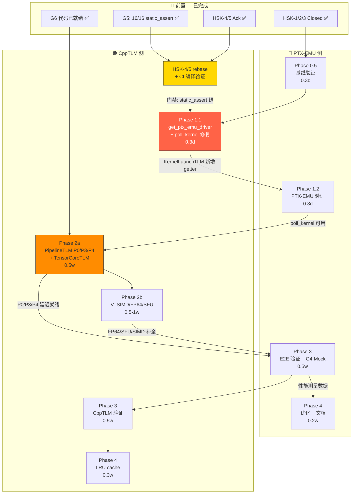

# PTX-EMU ↔ CppTLM 端到端协同仿真开发计划

> **状态**: 进行中 | **日期**: 2026-07-21 | **关联 ADR**: [ADR-0020](../adr/0020-cpptlm-injection-points.md), [ADR-0021](../adr/0021-cpptlm-d1-full-integration.md)

---

## 一、现状盘点

### PTX-EMU 侧

| 组件 | 状态 | 文件 |
|------|------|------|
| `cpptlm_bridge.h` ABI 真值源 | ✅ 就绪 | `include/cudart/cpptlm_bridge.h` |
| `IScoreboard` 接口 (4 methods) | ✅ 就绪 | `include/ptxsim/scoreboard_interface.h` |
| `IPipelineLatencyProvider` 接口 (2 methods) | ✅ 就绪 | `include/ptxsim/pipeline_interface.h` |
| `ITensorCoreTiming` 接口 (3 methods) | ✅ 就绪 | `include/ptxsim/tensor_core_interface.h` |
| `PtxEmuDriverApi` vtable (8 函数指针) | ✅ 就绪 | `include/cudart/cpptlm_bridge.h:190-206` |
| `PtxEmuDriverShim` 实现 (advance/inject_*/mark_complete) | ✅ 就绪 | `src/cudart/cpptlm_bridge/PtxEmuDriverShim.cpp` |
| SMContext 注入 setter/getter | ✅ 就绪 | `include/ptxsim/sm_context.h:67-78` |
| `exe_once()` 三段式注入 (Step A→B→C) | ✅ 就绪 | `src/ptxsim/core/sm_context.cpp` |
| `StubBridge` 零延迟桩 | ✅ 就绪 | `src/cudart/stub_bridge.h` |
| Bridge 异步路径 (`cudaLaunchKernel` 双入队) | ✅ 就绪 | `src/cudart/cudart_sim.cpp:600-712` |
| `cudaStreamSynchronize` + `cudaDeviceSynchronize` auto-advance | ✅ 就绪 | `src/cudart/cudart_sim.cpp:981-1044` |
| GLOBAL LD/ST timing-only 桥接 | ✅ 就绪 | `src/ptxsim/instructions/memory.cpp` |
| `SingletonGuard` 防重复初始化 | ✅ 就绪 | `src/cudart/cudart_sim.cpp:52-79` |
| `BUILD_LIB_CPPTLM_CUDART` CMake 集成 | ✅ 就绪 | `CMakeLists.txt:125-149` |
| `InstructionFactory::initialize()` bridge 路径修复 | ✅ 已修复 (2026-07-21) | `src/cudart/ptx_interpreter.cpp` |

### CppTLM 侧

| 组件 | 状态 | 文件 |
|------|------|------|
| Vendored ABI 头文件 (与 PTX-EMU MATCH) | ✅ 就绪 | `include/cudart/` |
| `cpptlm_set_driver` 强定义 | ✅ 就绪 | `src/tlm/gpu/ptx_emu_driver_shim.cc` |
| `IPtxEmuDriver` 窄接口 + `DriverWrapper` | ✅ 就绪 | `include/tlm/gpu/ptx_emu_driver.hh` |
| `MemoryBridge` (submit_kernel/synchronize_stream/global_access) | ✅ 就绪 | `src/tlm/gpu/memory_bridge.cc` |
| `ScoreboardTLM` (O(1) hash, CAPACITY=2048) | ✅ 就绪 | `src/tlm/gpu/scoreboard_tlm.cc` |
| `PipelineTLM` | ⚠️ P1 占位 (全部 return 1.0) | `src/tlm/gpu/pipeline_tlm.cc` |
| `TensorCoreTLM` | ⚠️ P1 占位 (全部 return 1) | `src/tlm/gpu/tensor_core_tlm.cc` |
| `KernelLaunchTLM::tick()` 调用 `driver_->advance()` | ✅ 就绪 | `src/tlm/gpu/kernel_launch_tlm.cc` |
| `GpuSocTLM::tick()` 递归推进子模块 | ✅ 就绪 | `src/tlm/gpu/gpu_soc_tlm.cc` |
| `main.cpp --f12b-ld` per-SM 注入 for-loop | ✅ 就绪 | `src/main.cpp:140-148` |
| `poll_kernel` 查询 PTX-EMU 完成状态 | ⚠️ P0 (立即返回 0, 不查 PTX-EMU) | `src/tlm/gpu/memory_bridge.cc:88-98` |

### 端到端数据流

```
CUDA 程序
  └→ cudaLaunchKernel()
      ├── [EMU_COSIM=1] g_cpptlm_bridge->submit_kernel(kernel_id, ...)   ──→ MemoryBridge
      │   └→ pending_kernels_[id] ← {copied_args}
      └── g_ptx_interpreter->prepareKernelLaunchRequest()                  ──→ GPUContext::task_queue

cudaDeviceSynchronize()
  └→ g_ptx_emu_driver_shim->advance(max=10M, actual)
      └→ while (state != EXIT) ctx_->exe_once()                            ← PTX-EMU 自驱
          └→ SMContext::exe_once()
              ├── Step A: Scoreboard 冒险检查 (若 scoreboard_ != nullptr)
              ├── warp->execute_warp_instruction(stmt, pc)
              ├── Step B: 延迟查询 (pipeline_provider_ != nullptr ? pipeline→get_fractional_cycles_by_type : InstructionLatencyTable fallback; 对 S_LD/S_ST/S_ATOM 自动路由到 P3_LSU)
              └── Step C: Scoreboard 释放 (若 scoreboard_ != nullptr)

CppTLM 侧 (GpuSocTLM::tick())
  └→ KernelLaunchTLM::tick()
      └→ driver_->advance(max_steps, &actual)                              ← CppTLM 驱动 PTX-EMU
          └→ [跨 .so] PtxEmuDriverShim::advance(max, actual)
              └→ while (ctx_->get_state() != EXIT) ctx_->exe_once()
```

---

## 二、剩余差距

| # | 差距 | 严重度 | 位置 | 修复计划 |
|---|------|--------|------|---------|
| **G1** | `poll_kernel` 不查 PTX-EMU 完成状态 | 🔴 HIGH | `CppTLM/src/tlm/gpu/memory_bridge.cc:88-98` | 改为查询 `driver_->is_kernel_complete(kernel_id)`, 不再立即返回 0 |
| **G2** | `PipelineTLM` 延迟模型为空 (全部 1.0) | 🟡 MEDIUM | `CppTLM/src/tlm/gpu/pipeline_tlm.cc` | 实现真实指令延迟查表 (FFMA 4.22, GLOBAL_LD 200+, etc) |
| **G3** | `TensorCoreTLM` 延迟模型为空 (全部 1) | 🟡 MEDIUM | `CppTLM/src/tlm/gpu/tensor_core_tlm.cc` | 实现真实 TC 延迟 (MMA.FP16=8, TF32=4, FP8=16, etc) |
| **G4** | `exe_once` 三段式注入在真实 CppTLM 注入下未经验证 | 🟡 MEDIUM | PTX-EMU `src/ptxsim/core/sm_context.cpp` | 端到端测试验证 Step A/B/C 正确运转 |
| **G5** | `PipelineId`/`TcPrecision` 双向 `static_assert` | ✅ **DONE** | CppTLM vendored copy `include/cudart/cpptlm_bridge.h:240-306` (`namespace abi_guards_g_d4`；PTX-EMU 原件仅 226 行，不含此块） | 16/16 static_assert PASS（12 端点枚举 + 4 签名级 `decltype` 验证），含负向测试——已通过 G-D4 验收门（2026-07-18） |
| **G6** | ~~LD/ST 延迟仍走 PTX-EMU 内置表~~ → ✅ **已解决**: `step_b_set_blocked_cycles()` 已调用 `pipeline_provider_->get_fractional_cycles_by_type(stmt.type, map_instruction_to_pipeline(stmt))`，其中 `map_instruction_to_pipeline` 已路由 S_LD/S_ST/S_ATOM → P3_LSU。`pipeline_provider_==nullptr` 时 fallback 到 `InstructionLatencyTable`。Phase 2a 实现 PipelineTLM 后**自动激活**，无需 PTX-EMU 侧改动 | 🟢 DONE | `src/ptxsim/core/sm_context.cpp` `step_b_set_blocked_cycles()` (fast-path ~L437, slow-path ~L564) | 待 Phase 2a PipelineTLM 实现后验证——已自动生效 |

---

## 三、分阶段实施计划

### Phase 0.5: 基线验证 — 建立已知良好基线

> **目标**: 确认 Phase 1-4 的起点状态无回归，避免后续调试时根因混淆
> **工时**: PTX-EMU 侧 0.3 天
> **注意**: 本阶段为纯基线回归验证，与 HSK 状态机无关。HSK-1/2/3 已于 2026-07-17 由 CppTLM 端回复 Closed（见 §五）。当前阻塞项为 HSK-4/5 rebase 验证。

#### 0.5.1 OFF 模式全量回归

```bash
# BUILD_LIB_CPPTLM_CUDART=OFF — 字节级兼容验证
cd /workspace/project/PTX-EMU/build
cmake -S .. -B . -DBUILD_LIB_CPPTLM_CUDART=OFF -DCMAKE_BUILD_TYPE=Release
cmake --build .
ctest --output-on-failure  # 600+ tests 全部 PASS
```

#### 0.5.2 ON + StubBridge 路径验证

```bash
# BUILD_LIB_CPPTLM_CUDART=ON — StubBridge auto-attach + auto-advance
cmake -S .. -B . -DBUILD_LIB_CPPTLM_CUDART=ON -DCMAKE_BUILD_TYPE=Release
cmake --build .
ctest -L "cpptlm|cosim" --output-on-failure  # 现有 CppTLM 相关测试 PASS
```

#### 0.5.3 确认已知良好基线

- `g_cpptlm_bridge == nullptr`（OFF 模式）：字节级与原路径一致
- `g_cpptlm_bridge == &stub`（ON 模式）：StubBridge 零延迟路径正常
- 如有回归 → **先修复再进入 Phase 1**（避免 Phase 1 调试时根因在基线而非 G1）

---

### Phase 1: 打通 poll_kernel → PTX-EMU 完成状态查询

> **目标**: PTX-EMU 端 kernel 执行完成后，`poll_kernel` 返回 0
> **工时**: PTX-EMU 侧 0.3 天 + CppTLM 侧 0.3 天

> **前置依赖**: Phase 0.5 基线验证全部 PASS

#### 1.1 CppTLM 侧修改

**文件**: 
- `src/tlm/gpu/memory_bridge.cc` `poll_kernel()`
- `include/tlm/gpu/kernel_launch_tlm.hh` — **须新增** `get_ptx_emu_driver()` getter（当前仅有 `set_ptx_emu_driver()`）

当前 (P0): 立即返回 0, 自行 erase pending 记录
```cpp
uint64_t MemoryBridge::poll_kernel(uint64_t kernel_id) {
    auto it = pending_kernels_.find(kernel_id);
    if (it == pending_kernels_.end()) return UINT64_MAX;
    pending_kernels_.erase(it);
    return 0;
}
```

改为 (P1): 查询 PTX-EMU 完成状态
```cpp
uint64_t MemoryBridge::poll_kernel(uint64_t kernel_id) {
    auto it = pending_kernels_.find(kernel_id);
    if (it == pending_kernels_.end()) return UINT64_MAX;

    // P1: 查询 PTX-EMU driver 的完成状态
    if (kernel_launch_ && kernel_launch_->get_ptx_emu_driver()) {
        if (kernel_launch_->get_ptx_emu_driver()->is_kernel_complete(kernel_id)) {
            pending_kernels_.erase(it);
            return 0;
        }
        return 1;  // 未完成
    }

    // Fallback (无 driver): P0 行为
    pending_kernels_.erase(it);
    return 0;
}
```

`pending_kernels_` 生命周期管理:
- PTX-EMU 确认完成 → `poll_kernel` erase
- 无 driver fallback → 立即 erase

**前置 CppTLM 侧改动**（Phase 1.1 实施时同步完成）:
```cpp
// include/tlm/gpu/kernel_launch_tlm.hh — 新增 getter
IPtxEmuDriver* get_ptx_emu_driver() const { return driver_; }
// 替代方案: MemoryBridge 直接持有 IPtxEmuDriver* 指针（在 GpuSocTLM 构造时注入）
```

#### 1.2 PTX-EMU 侧验证

- **模式 A — StubBridge + auto-advance**: `EMU_COSIM=1` 下 `StubBridge` 路径不受影响 (`g_ptx_emu_driver_shim->mark_complete()` 在 `on_complete` 中调用)
- **模式 B — 真实 CppTLM MemoryBridge**: 加载 `libcpptlm_cudart.so` → `cpptlm_set_driver` → `g_ptx_emu_driver` 非 null → `is_kernel_complete` 可查询
- 验证 `e2e_cosim_vector_add` 在**两种模式**下均 PASS
- **调试原则**: 如果任一模式失败，先验证 G4（用 nullptr scoreboard/pipeline/tc 确认 exe_once 三段式注入无回归），再定位 G1 问题。避免因 G4 未验证而误判 G1 失败根因

---

### Phase 2a: Pipeline / TensorCore 延迟模型 — 核心管线

> **目标**: P0_INT_FP32 + P3_LSU + P4_TC 核心管线延迟由 CppTLM 模型提供
> **工时**: CppTLM 侧 0.5 周
> **前置依赖**: Phase 1 完成（poll_kernel 可用，advance() 可驱动 exe_once 三段式注入）

#### 2a.1 PipelineTLM 延迟表 — 核心管线

**文件**: `src/tlm/gpu/pipeline_tlm.cc`

| 管线 | 指令 | 目标延迟 (cycles) | 来源 |
|------|------|------------------|------|
| **P0_INT_FP32** | IADD, MOV, SETP | 1.0 | A100 whitepaper §5.4.1 单周期吞吐 |
| | FFMA, FADD, FMUL | 4.22 | A100 SM 间距 (GPGPU-Sim `gpu_config.h:FFMA_LATENCY`) |
| | IMAD, IMUL | 2.0 | 整数乘法 |
| | CVT, LOP3 | 1.0 | 简单操作 |
| **P3_LSU** | GLOBAL LD | 200+ | DRAM + NoC + cache miss (A100: 404 cycles typical, GPGPU-Sim `DRAM_LATENCY`) |
| | GLOBAL ST | 20+ | 写入延迟 |
| | LOCAL LD/ST | 5.0 | L1 缓存 |
| | SHARED LD/ST | 1.0 | 片上 SRAM |
| | ATOM, RED | 200+ | 原子操作 |
| **P4_TC** | TensorCore 操作 | 0 | 由 TensorCoreTLM 处理 |

#### 2a.2 TensorCoreTLM 延迟表

**文件**: `src/tlm/gpu/tensor_core_tlm.cc`

| 精度 | 典型延迟 (cycles) | 来源 |
|------|------------------|------|
| FP16 | 8 | A100 MMA 指令间距 (GPGPU-Sim `tensor_core_config.h`) |
| TF32 | 4 | - |
| BF16 | 8 | - |
| FP8 | 16 | - |
| FP4 | 32 | - |
| INT8 | 8 | - |

#### 2a.3 枚举值同步

**文件**: `include/cudart/cpptlm_bridge.h` (CppTLM vendored copy)

```cpp
// G-D4: 12 端点 + 4 签名 static_assert (已在 cpptlm_bridge.h 末尾)
static_assert(static_cast<uint32_t>(PipelineId::P0_INT_FP32) == 0, "CppTLM: PipelineId::P0_INT_FP32 != 0");
static_assert(static_cast<uint32_t>(PipelineId::V_SIMD)     == 1, "CppTLM: PipelineId::V_SIMD != 1");
// ... P1_FP64=2, P2_SFU=3, P3_LSU=4, P4_TC=5
static_assert(static_cast<uint32_t>(TcPrecision::FP4)  == 0, "CppTLM: TcPrecision::FP4 != 0");
// ... FP6=1, FP8=2, FP16=3, BF16=4, TF32=5
```

#### 2a.4 验证方式

```bash
# CppTLM 端
cd /workspace/project/CppTLM/build && ./bin/cpptlm_tests "[gpu][d1p1]"

# PTX-EMU 端 — 注入后延迟验证
EMU_COSIM=1 ./build/bin/tests/e2e_cosim_vector_add
```

---

### Phase 2b: Pipeline / TensorCore 延迟模型 — 剩余管线

> **目标**: V_SIMD + P1_FP64 + P2_SFU 延迟模型补全
> **工时**: CppTLM 侧 0.5-1 周
> **前置依赖**: Phase 2a 完成

#### 2b.1 PipelineTLM 延迟表 — 剩余管线

| 管线 | 指令 | 目标延迟 (cycles) | 来源 |
|------|------|------------------|------|
| **V_SIMD** | 向量操作 | 1.0 | 标量化 SIMD |
| **P1_FP64** | DADD, DMUL, DFMA | 8.0 | 2× FP32 |
| **P2_SFU** | MUFU.SIN, COS | 16.0 | 超越函数 (A100 SFU 管线) |
| | MUFU.RCP, RSQRT | 4.0 | 倒数/平方根倒数 |
| | MUFU.SQRT | 8.0 | 平方根 |
| | MUFU.LG2, EX2 | 8.0 | 对数/指数 |

#### 2b.2 验证方式

同 Phase 2a.4

---

---

### Phase 3: 端到端验证

> **目标**: 真实 CUDA 程序在 CppTLM 时序模型下执行，输出正确，spec Scenario 全覆盖
> **工时**: PTX-EMU 侧 0.5 周 + CppTLM 侧 0.5 周
> **前置依赖**: Phase 2a 完成（核心管线延迟可用；G6 已由 `step_b_set_blocked_cycles` 自动激活，无需额外任务）

#### 3.1 测试矩阵

| 测试 | 类型 | 验证维度 | 覆盖 spec Scenario |
|------|------|---------|-------------------|
| `e2e_cosim_vector_add` | E2E | 基础 LD/ST/ADD 延迟 | auto-co-sim: "Standard CUDA vectorAdd works as co-simulation" |
| `e2e_barrier_warp_sync` | E2E | Barrier 同步 + pipeline 阻塞（经 bridge path） | auto-co-sim: "barrier kernel via bridge path" |
| `e2e_blackwell_gemm` | E2E | TensorCore MMA 延迟 + scoreboard | cpptlm-d1-full: MMA 时序精度 |
| `e2e_flashattention_mini` | E2E | 多指令混合, 复杂控制流 | 时序压力测试 |
| 手动 GEMM kernel | E2E | 性能 cycle count 对比 (内置 vs CppTLM) | 精度对比 |
| `e2e_cosim_infinite_loop_ceiling` | E2E | advance ceiling 耗尽返回 `cudaErrorUnknown`；二次 `cudaDeviceSynchronize` 不 re-advance 已清理 kernel | auto-co-sim: "advance ceiling prevents hang" + "ceiling exhaustion cleans up state" |
| `e2e_cosim_multi_kernel_drain` | E2E | 多 kernel (N≥3) + 多次 `cudaDeviceSynchronize` 全部 drain；断言已返回 0 的 kernel_id 不再被 `poll_kernel` | auto-co-sim: "repeated cudaDeviceSynchronize drains all pending kernels" |
| `unit_bridge_submit_error` | 单元 | `submit_kernel` 返回非 0 时错误码传递给 `cudaLaunchKernel` | cpptlm-d1-full: "bridge submit 失败 → 错误码传递" |
| `unit_is_global_space_qualifier_walk` | 单元 | `is_global_space()` 遍历整个 qualifier 列表 | cpptlm-d1-full: "is_global_space() 遍历整个 qualifier 列表" (Lessons Learned #1 — 跨模块间接状态翻译: 迁移函数时漏掉看似冗余的 qualifier 遍历检查) |
| `unit_kernel_id_uniqueness` | 单元 | `kernel_id` 连续生成 N=1000 无重复 | cpptlm-d1-full: "kernel_id 唯一性保证" |

#### 3.2 回归检查

```bash
# OFF 模式全量回归 — 确保 bridge=nullptr 字节级兼容
cd /workspace/project/PTX-EMU/build
cmake -S .. -B . -DBUILD_LIB_CPPTLM_CUDART=OFF -DCMAKE_BUILD_TYPE=Release
cmake --build .
ctest --output-on-failure  # 全量 600+ tests PASS

# ON 模式 CppTLM 相关测试
cmake -S .. -B . -DBUILD_LIB_CPPTLM_CUDART=ON -DCMAKE_BUILD_TYPE=Release
cmake --build .
ctest -L "cpptlm|cosim" -V
```

#### 3.3 性能测量

- per-tick overhead: `GpuSocTLM::tick()` 耗时 (预期 < 1μs per tick)
- advance 最大吞吐: `PtxEmuDriverShim::advance(1M)` 耗时

#### 3.4 G4 专项验证 — exe_once 三段式注入点调用计数 (Mock 注入)

> **目标**: 验证 Step A/B/C 注入点在真实 CppTLM 注入下被实际调用（而非全部因 nullptr 检查跳过）
> **测试类型**: 类型二（指令序列集成测试，`tests/integration/cpptlm/`），使用 `ptxsim::testing::step_warp` 驱动

**测试文件** (PTX-EMU 侧，`tests/integration/cpptlm/`):
- `test_mock_injection_fast_path.cpp`: fast-path (`lanes_by_pc.size() == 1`)，构造单 NOP 指令
- `test_mock_injection_slow_path.cpp`: slow-path (`lanes_by_pc.size() > 1`)，构造分歧 Branch 产生两个 PC 组

```cpp
// 1. MockScoreboard 断言 check_and_block() 被调用 ≥1 次
// 2. MockPipelineProvider 断言 get_fractional_cycles_by_type() 被调用 ≥1 次
// 3. MockTensorCoreTiming 断言 get_latency() 被调用 (如有 TC 指令，构造 StatementType→P4_TC)
// 4. fast-path (单 PC) 和 slow-path (多 PC) 两个分支均覆盖 (ADR-0020 R1 风险项)
// 5. nullptr 注入 = 字节级回退（调用计数为 0，但不崩溃）
```

**验证标准**:
- fast-path: `lanes_by_pc.size() == 1` → 单指令执行，Step A/B/C 各调用 1 次
- slow-path: `lanes_by_pc.size() > 1` → 多指令分组执行，Step A/B/C 按指令数调用
- TC 路径: 构造一条 `StatementType` 映射到 `PipelineId::P4_TC` 的语句，注入 `MockTensorCoreTiming`
- nullptr: 调用计数 = 0，功能正常（无崩溃、无死循环）

---

### Phase 4: 优化与文档

> **目标**: 精细化 GlobalAccess NoC 延迟, 产出协同仿真精度报告
> **工时**: PTX-EMU 侧 0.2 周 + CppTLM 侧 0.3 周

#### 4.1 GlobalAccess NoC 延迟缓存优化

> **说明**: 这是 **NoC 延迟查询性能优化**，不是 G6 修复。G6（LD/ST 延迟走 P3_LSU）已由 `step_b_set_blocked_cycles()` + `map_instruction_to_pipeline` 自动解决（Phase 2a PipelineTLM 实现后激活）。

```cpp
// 当前: 每次 LD/ST 都查 CrossbarTLM (naive)
// 优化: LRU cache 缓存 device_addr → latency 映射，减少 per-access 跨 .so 调用
uint64_t MemoryBridge::global_access(uint64_t device_addr, ...) {
    auto it = latency_cache_.find(device_addr);
    if (it != latency_cache_.end()) return it->second;
    uint64_t latency = gpu_xbar_->query_latency(device_addr);
    latency_cache_[device_addr] = latency;
    return latency;
}
```

#### 4.2 文档更新

- 更新 PTX-EMU `AGENTS.md` 已知限制 CppTLM 状态
- 产出 `docs/reports/cpptlm-co-sim-accuracy-report.md` 精度对比报告
- 产出 `docs/reports/cpptlm-co-sim-perf-report.md` 性能开销报告

---

### Phase 5 (Phase 3.5): Spec Traceability Matrix

> 对照 spec Scenario 确认计划覆盖度，Phase 3 完成标准

#### cpptlm-d1-full spec

| Requirement | Scenario | 覆盖 | 对应任务 |
|------------|----------|------|---------|
| cpptlm-bridge-interface | ABI 真值源 — header is canonical source | ✅ | §一 (就绪，已归档) |
| | nullptr 全局指针 = 字节级向后兼容 | ✅ | Phase 0.5 + Phase 3.2 |
| | cudaStream_t 宽度 static_assert | ✅ | §一 (cpptlm_bridge.h 已包含) |
| | 接口签名演进触发版本号 bump | ✅ (N/A) | 非实施任务：HSK-1 加入 CI 规则（`cpptlm_bridge.h` 签名变更而 `CPPTLMBRIDGE_VERSION` 未 bump → CI fail），见 ADR-0021 §HSK 状态机 |
| cudart-async-launchkernel | 异步路径立即返回 | ✅ | §一 (就绪) |
| | nullptr 路径字节级回退 | ✅ | Phase 0.5 + Phase 3.2 |
| | kernel_id 唯一性保证 (N ≥ 1000) | ✅ | Phase 3.1 `unit_kernel_id_uniqueness` |
| | bridge submit 失败 → 错误码传递 | ✅ | Phase 3.1 `unit_bridge_submit_error` |
| | kernel_name 来自 func2name 表 | ✅ | §一 (就绪，`cudaLaunchKernel` 异步路径) |
| cudart-stream-synchronization | 按 stream_id 过滤 | ✅ | §一 (就绪) |
| | 迭代器失效修复 | ✅ | §一 (就绪，`cudaStreamSynchronize` 双循环 fix) |
| | 多次同步不重复 poll 已删除 kernel | ✅ | Phase 3.1 `e2e_cosim_multi_kernel_drain`: 用 MockBridge 记录全部 `poll_kernel(kernel_id)` 调用序列，断言 返回 0 的 ID 在后续 `cudaDeviceSynchronize` 中不再出现 |
| ptx-global-ld-st-bridge | is_global_space() 遍历整个 qualifier 列表 | ✅ | Phase 3.1 `unit_is_global_space_qualifier_walk` (Lessons Learned #1 — 跨模块间接状态翻译) |
| ptxemu-driver-shim | advance(max, actual) 调用 exe_once() | ✅ | §一 (就绪，`step_b_set_blocked_cycles` 已在 fast-path + slow-path 调用 pipeline_provider_) |
| | mark_complete 在 on_complete 中调用 | ✅ | §一 (就绪) |
| libcpptlm-cudart-integration | ExternalProject_Add CMake 集成 | ✅ | HSK-3 |

#### auto-co-simulation spec

| Requirement | Scenario | 覆盖 | 对应任务 |
|------------|----------|------|---------|
| Standard CUDA zero-code co-sim | vectorAdd works as co-simulation | ✅ | Phase 3.1 `e2e_cosim_vector_add` |
| | Auto-attach StubBridge at initialization | ✅ | §一 (就绪) |
| | Auto-advance in synchronize | ✅ | §一 (就绪) |
| | advance ceiling prevents hang | ✅ | Phase 3.1 `e2e_cosim_infinite_loop_ceiling` |
| | advance ceiling exhaustion cleans up state | ✅ | Phase 3.1 `e2e_cosim_infinite_loop_ceiling` (ceiling 耗尽后状态清理 + 后续 sync 不 re-advance) |
| | cpptlm_attach_bridge override preserves testability | ✅ | §一 (就绪，`g_bridge_user_override` 机制) |
| | StubBridge poll_kernel returns error for unknown id | ✅ | §一 (就绪) |
| | g_ptx_interpreter null at launch returns error | ✅ | §一 (就绪) |
| | g_ptx_emu_driver_shim remains static | ✅ | §一 (就绪) |
| | cudaLaunchKernel returns bridge submit_kernel error | ✅ | Phase 3.1 `unit_bridge_submit_error` |
| Bridge path correctness | multi-warp kernel via bridge path | ✅ | Phase 3.1 `e2e_barrier_warp_sync` |
| | barrier kernel via bridge path | ✅ | Phase 3.1 `e2e_barrier_warp_sync` |
| | repeated cudaDeviceSynchronize drains all | ✅ | Phase 3.1 `e2e_cosim_multi_kernel_drain` |
| Backward compatibility | OFF mode byte-level regression | ✅ | Phase 0.5 + Phase 3.2 |
| Mock injection testability | Mock 注入点调用计数 | ✅ | Phase 3.4 |

#### HSK 合规

| HSK | 要求 | 覆盖 | 对应任务 |
|-----|------|------|---------|
| **HSK-4** | IScoreboard / IPipelineLatencyProvider / ITensorCoreTiming 接口 enum 值与 CppTLM RFC-P1-003 字节级一致 | ✅ | G5 done (16/16 static_assert) + Phase 2a 延迟表 |
| **HSK-5** | exe_once Step A/B/C 三段注入在真实 CppTLM 驱动下行为正确 | ✅ | Phase 3.4 (G4 Mock 注入验证) |

> **Phase 3 完成标准**: 本矩阵 100% ✅（无 ⚠️ 残留）

---

### Phase 6: 协作执行流程

> PTX-EMU ↔ CppTLM 双端步骤依赖与门禁



#### 步骤表

| # | 步骤 | 仓库 | 输入 | 输出 | 验证方式 | 串/并行 |
|---|------|------|------|------|---------|---------|
| **S0** | HSK-4/5 rebase + CI | CppTLM | G5 done, HSK-4/5 Ack | `static_assert` 16/16 CI 绿 | CppTLM CI 日志 URL | 串行（门禁） |
| **S1** | Phase 0.5 基线验证 | PTX-EMU | HSK-1/2/3 Closed | OFF/ON 双模式无回归 | `ctest` 全量 PASS | 串行（门禁） |
| **S2** | Phase 1.1 poll_kernel 修复 | CppTLM | S0 + S1 | `get_ptx_emu_driver()` getter, `poll_kernel` 查完成 | CppTLM `cpptlm_tests` PASS | 串行 |
| **S3** | Phase 1.2 PTX-EMU 验证 | PTX-EMU | S2 (新 .so) | 双模式 e2e_cosim_vector_add PASS | StubBridge + 真实 MemoryBridge | 串行 |
| **S4** | Phase 2a 核心管线延迟 | CppTLM | S3 | PipelineTLM P0/P3/P4 + TensorCoreTLM | CppTLM `[gpu][d1p1]` PASS | 串行 |
| **S5** | Phase 2b 剩余管线延迟 | CppTLM | S4 | V_SIMD/FP64/SFU 补全 | 同 S4 | **🟡 可并行** |
| **S6** | Phase 3 PTX-EMU E2E 验证 | PTX-EMU | S4(核心) + S5(可选) | 10 测试 + G4 Mock 注入 | `ctest` 全量 + traceability 100% | 串行 |
| **S7** | Phase 3 CppTLM 性能测量 | CppTLM | S6 (同 .so) | tick overhead + advance 吞吐 | 与 S6 共享 .so | **🟢 与 S6 并行** |
| **S8** | Phase 4 优化 + 文档 | 双端 | S6 + S7 | LRU cache + 精度/性能报告 | 文档审核 | 串行 |

#### 门禁卡

| 门禁 | 位置 | 条件 | 失效后果 |
|------|------|------|---------|
| 🟡 **S0→S2** | HSK-4/5 CI | CppTLM rebase `cpptlm_bridge.h` + 3 接口头, `static_assert` 16/16 绿 | 枚举值错位导致时序模型静默错误 |
| 🔴 **S2→S3** | G1 getter | `KernelLaunchTLM::get_ptx_emu_driver()` 存在, `poll_kernel` 查询可用 | poll_kernel 无法获知 kernel 完成状态 |
| 🟡 **S5→S6** | Phase 3 准入 | Phase 2a 完成即可启动核心测试(S6)；Phase 2b 完成后补 FP64/SFU/SIMD 测试 | 无 2b 则 Phase 3 FP64/SFU 测试降级 |

| 功能 | PTX-EMU 文件 | CppTLM 文件 |
|------|-------------|------------|
| ABI 真值源 | `include/cudart/cpptlm_bridge.h` | `include/cudart/cpptlm_bridge.h` (vendored) |
| Scoreboard 接口 | `include/ptxsim/scoreboard_interface.h` | `include/tlm/gpu/scoreboard_tlm.hh` + `src/tlm/gpu/scoreboard_tlm.cc` |
| Pipeline 接口 | `include/ptxsim/pipeline_interface.h` | `include/tlm/gpu/pipeline_tlm.hh` + `src/tlm/gpu/pipeline_tlm.cc` |
| TC Timing 接口 | `include/ptxsim/tensor_core_interface.h` | `include/tlm/gpu/tensor_core_tlm.hh` + `src/tlm/gpu/tensor_core_tlm.cc` |
| Driver vtable | `src/cudart/cpptlm_bridge/PtxEmuDriverShim.cpp` | `src/tlm/gpu/ptx_emu_driver_shim.cc` |
| 三段式注入 | `src/ptxsim/core/sm_context.cpp` Step A/B/C | `include/tlm/gpu/ptx_emu_driver.hh` `IPtxEmuDriver` |
| Bridge 异步路径 | `src/cudart/cudart_sim.cpp:600-712` | `src/tlm/gpu/memory_bridge.cc` `MemoryBridge` |
| Kernel 调度 | `src/ptxsim/core/gpu_context.cpp` `exe_once` | `src/tlm/gpu/kernel_launch_tlm.cc` `tick()` |
| GPU SoC 推进 | `PtxEmuDriverShim::advance()` | `src/tlm/gpu/gpu_soc_tlm.cc` `tick()` |
| 注入接线 | `initialize_environment()` 创建 shim | `src/main.cpp:140-155` for-loop inject_*（含 nullptr fallback 分支） |
| 同步 sync | `src/cudart/cudart_sim.cpp:981-1044` | `src/tlm/gpu/memory_bridge.cc:100-132` |

---

## 五、HSK 握手状态

> **截至 2026-07-21**（与 CppTLM AGENTS.md:191-208 对齐）:
> 🟢 HSK-1/2/3 Closed（2026-07-17 CppTLM 已回复）
> 🟡 HSK-4/5 Ack（已交付，待 CppTLM rebase 编译验证）
> 当前阻塞项: HSK-4/5 rebase 验证，非 HSK-1/2/3。

| HSK | 主题 | 状态 | CppTLM 回复 | 锁定 commit / 证据 |
|-----|------|:----:|-----------|-------------------|
| **HSK-1** | ABI commit hash 锁定 | ✅ Closed | 2026-07-17 `hsk-1-2-3-responses.md` | PTX-EMU commit `8dc000ec` + `CPPTLMBRIDGE_VERSION=1` |
| **HSK-2** | ANTLR4 4.13.2 版本契约 | ✅ Closed | 同上，N/A for CppTLM | 4 权威源全为 4.13.2 |
| **HSK-3** | CMake `ExternalProject_Add` 暴露方式 | ✅ Closed | 同上 | `CPPTLM_COMMIT_HASH=73e5422` |
| **HSK-4** | 3 纯虚接口头文件 (IScoreboard/IPipelineLatencyProvider/ITensorCoreTiming) | 🟡 Ack | 2026-07-17 `hsk-4-5-responses.md` | PTX-EMU commits `8acfd2d1` / `9e7361b9` / `463038e0`；enum 值与 CppTLM RFC-P1-003 字节级一致 |
| **HSK-5** | exe_once 3-step 注入 (Step A/B/C) | 🟡 Ack | 同上 | PTX-EMU commits `367fd6a5` + `921b4542`；27/27 helpers + 13/13 barrier PASS |

> **当前真实门禁**（替代原 "HSK-1/2/3 须推进"）: HSK-4/5 须推进到 CppTLM CI rebase + 编译验证通过（`static_assert` 16/16 + 签名级 `decltype`）。详见 CppTLM `openspec/changes/cpptlm-d1-p1-pipeline-scoreboard/tasks.md` G-D4 验收门 + `docs/superpowers/specs/2026-07-17-hsk-4-5-responses.md`。

---

## 六、相关文档

| 文档 | 路径 |
|------|------|
| ADR-0020 注入决策 | `docs/adr/0020-cpptlm-injection-points.md` |
| ADR-0021 D1-Full 集成 | `docs/adr/0021-cpptlm-d1-full-integration.md` |
| D1-Full spec | `openspec/specs/cpptlm-d1-full/spec.md` |
| Auto-co-sim spec | `openspec/specs/auto-co-simulation/spec.md` |
| Spec Traceability Matrix | 本文档 §三.5 |
| CppTLM 端主文档 | `/workspace/project/CppTLM/AGENTS.md` |
| 协同开发经验 | `docs/dev-process/lessons-learned.md` |